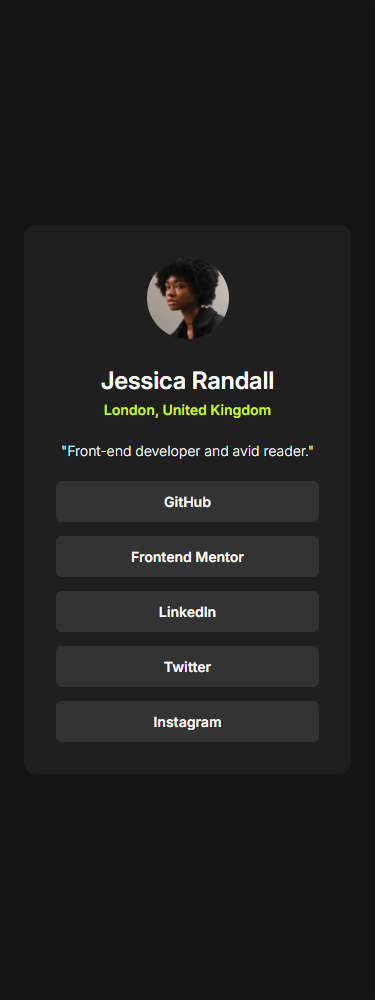
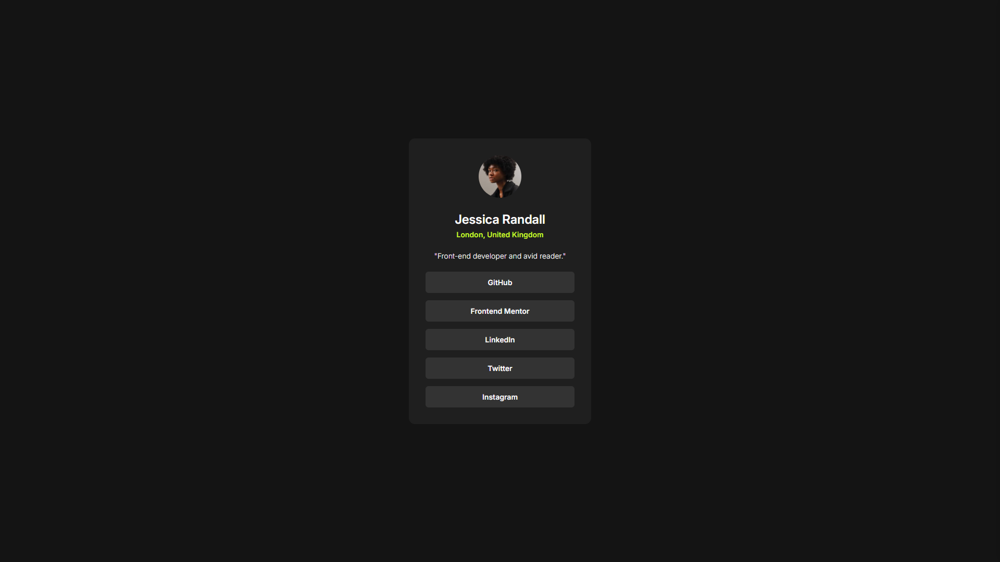

# Frontend Mentor - Social links profile solution

This is a solution to the [Social links profile challenge on Frontend Mentor](https://www.frontendmentor.io/challenges/social-links-profile-UG32l9m6dQ). Frontend Mentor challenges help you improve your coding skills by building realistic projects. 

## Table of contents

- [Overview](#overview)
  - [The challenge](#the-challenge)
  - [Screenshot](#screenshot)
  - [Links](#links)
- [My process](#my-process)
  - [Built with](#built-with)
  - [What I learned](#what-i-learned)
- [Author](#author)

## Overview

### The challenge

- There should be hover and focus states for social media links on the page.
- Page must be responsive.
- Page must look as close to the design.

### Screenshot

### Links

- Solution URL: [Solution](https://github.com/kalpesh172000/social-link-profile-main)
- Live Site URL: [Live site](https://kalpesh172000.github.io/social-link-profile-main/)

## My process

### Built with

- Semantic HTML5 markup
- CSS custom properties
- Flexbox
- Mobile-first workflow

### What I learned

This problem was really close to the previous ones. I didn't do anything new.

## Author

- Frontend Mentor - [@kalpesh172000](https://www.frontendmentor.io/profile/kalpesh172000)
